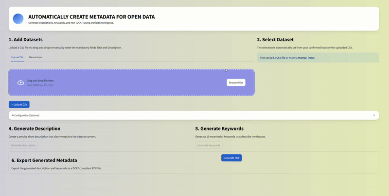
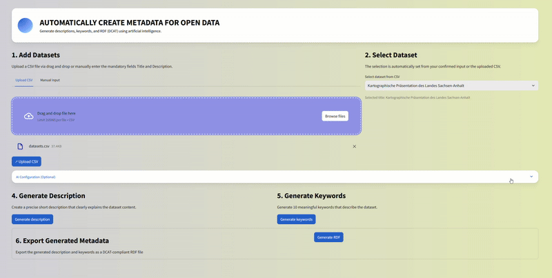
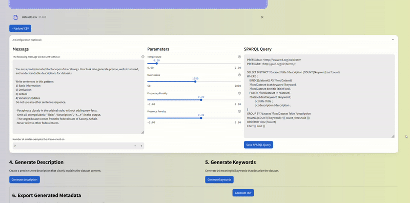

# LLM DCAT Generator

**Interactive Generation of DCAT Metadata with LLMs**  

This repository contains a prototype interface for the automatic generation of DCAT metadata using Large Language Models (LLMs).  
The interface was developed as part of a **Bachelor thesis on automatic metadata generation at Hochschule Merseburg**.

  

---

## ✨ Features

### 🔎 Dataset Selection
- Users can **select existing datasets** (with title and URL) that **lack a description**.  
- Datasets can be:
  - Uploaded as a list, or  
  - Entered manually.  

---

### ⚙️ LLM Configuration


- Configure **generation parameters**:
  - **Temperature** (creativity vs. determinism).  
  - **Presence and frequency penalties** (to reduce repetition).  
- Adapt the **prompt** to guide the LLM.  
- Configure a **SPARQL query** to retrieve *few-shot examples* (title + description) from a DCAT metadata catalog endpoint (currently: [GovData](https://www.govdata.de/)).  
- The LLM uses these examples together with the dataset title to generate a **plausible dataset description**.  

---

### 📝 Metadata Generation & Export

- Generate:
  - **Dataset description**  
  - **DCAT keywords**  
- Export results as a **DCAT snippet**.  
- Future work: API integration for direct publishing into open data portals.  

---

## 🚀 Getting Started

### Prerequisites
- Python 3.9+  
- [Streamlit](https://streamlit.io/)  

### Installation
```bash
git clone https://github.com/yourusername/llm-dcat-generator.git
cd llm-dcat-generator
pip install -r requirements.txt
```

### Run the App
```bash
streamlit run metadata-app{-english}.py
```

The app will launch in your browser at http://localhost:8501.